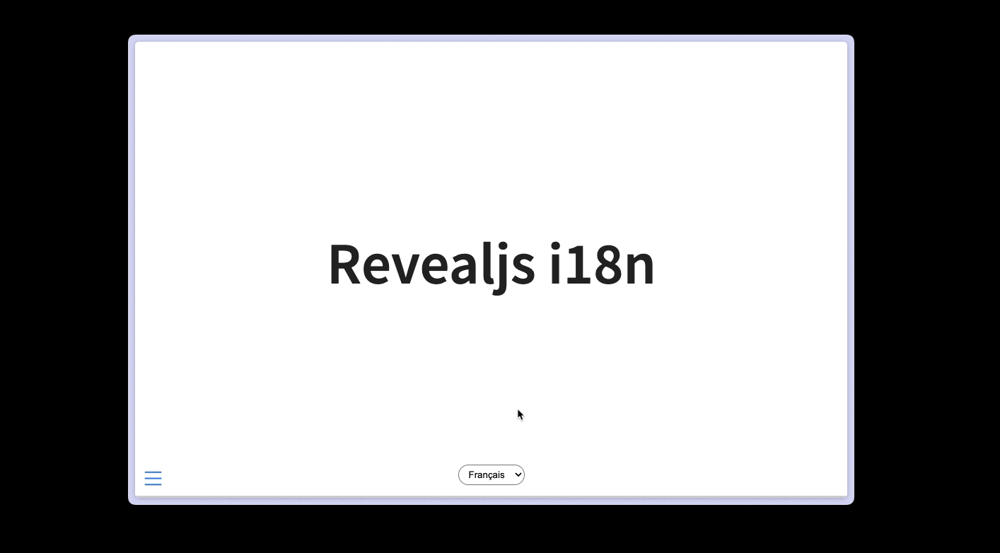

# I18n Extension For Quarto

i18n extension for Quarto helps to **manage multiple languages** in your documents. You can use it with a default language or with a language selector.

## Installing

```bash
quarto add ArthurData/quarto-i18n
```

> Requires Quarto >=1.5.0

## Usage

### Use the default language

You can use it to manage multiple languages in your documents.

Firstly, you can use it with a default language:

```r
---
title: Revealjs i18n
format:
  revealjs:
    i18n:
      defaultLocale: "it"
      fr:
        morning: "Le matin"
        getting-up: "Se lever"
      en:
        morning: "In the morning"
        getting-up: "Getting up"
      de:
        morning: "Morgen"
        getting-up: "Aufstehen"
      it:
        morning: "Al mattino"
        getting-up: "Alzarsi"
revealjs-plugins:
  - i18n
---

<span data-i18n-key="morning"></span>

<span data-i18n-key="getting-up"></span>
```

In this case, the default language is Italian. You will not be able to change the language.

### Use the language selector

You can also use a language selector to change the language of your document.

This extension came with a language selector that you can add to your document.

```r

```

This will add a dropdown to your document that will allow you to change the language. The `choices` attribute is a list of languages that you want to display in the dropdown. The `selected` attribute is the default language.

`fr` is the key of the language and `Français` is the value that will be displayed in the dropdown.

```r
---
title: Revealjs i18n
format:
  revealjs:
    footer: |
      
    i18n:
      defaultLocale: "fr"
      fr:
        morning: "Le matin"
        getting-up: "Se lever"
      en:
        morning: "In the morning"
        getting-up: "Getting up"
      de:
        morning: "Morgen"
        getting-up: "Aufstehen"
      it:
        morning: "Al mattino"
        getting-up: "Alzarsi"
revealjs-plugins:
  - i18n
---

<span data-i18n-key="morning"></span>

<span data-i18n-key="getting-up"></span>
```

</a>
